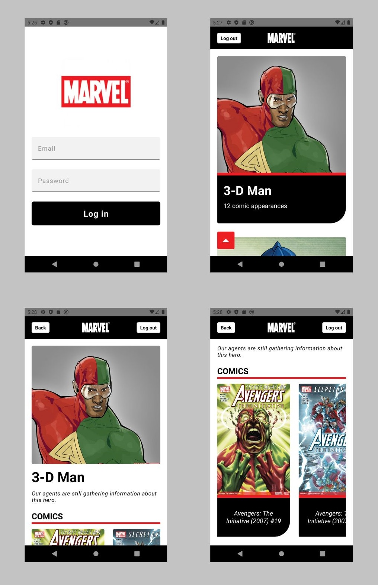

# Marvel Heroes

Welcome to **Marvel Heroes**! An app that showcases information about Marvel superheroes and their comics. This app allows users to explore a vast collection of heroes, view their details, and browse through the associated comics.

## Screenshots

<div align="center">
  
</div>

## Features

- **Browse Heroes**: Explore a list of Marvel superheroes and their key information.
- **Hero Details**: View detailed information about a specific superhero, including their name, description, and related comics.
- **Comic appearances**: Get a list for all the comics associated with a hero with a cover image and title.

## Technologies Used

- **React Native** v0.63
- **Typescript**
- **Redux Toolkit**
- **Apisauce**
- **React Navigation**
- **Jest & React Native Testing Library**
- **Husky**
- **ESLint & Prettier**
- **Developing target:** Android

## Project Structure

```
src
├── components
│   ├── Comic
│   ├── ComicsList
│   ├── Header
│   ├── HeroCard
│   ├── HeroesList
│   └── LoginForm
├── hooks
│   ├── useLoadCurrentHero
│   └── useUser
│       └── utils
├── navigation
│   ├── ProviderWrappers
│   ├── StackNavigator
│   └── types
├── proxy
├── Screens
│   ├── HeroDetailScreen
│   ├── HomeScreen
│   └── LoginScreen
├── store
│   └── features
│       ├── heroSlice
│       └── userSlice
├── styles
└── utils
```

## Setup

The Project was developed using Node version `16.20.0`.

Install the dependencies. Run the following command in the project root:

```
npm install
```

Once the installation has finished, make sure that the `tsconfig.json` matches the one present in the repository.

Start the Metro Bundler running the following command in the project root:

- Visit the [React Native documentation](https://reactnative.dev/docs/0.63/environment-setup) for environment setup instructions.

```
npm start
```

Open a new terminal and run:

```
npm run android
```

To run the test suite, use the following commands:

```
npm test

npm run test:coverage
```

## Project Status

Project is: _Done_
